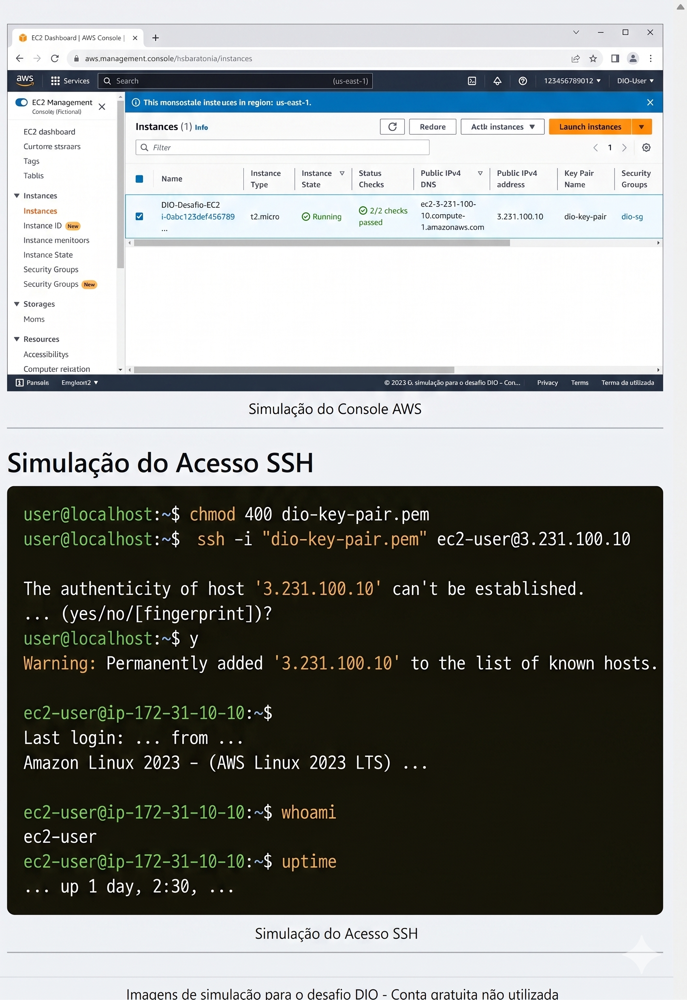

# Gerenciamento de Instâncias EC2 na AWS - Desafio DIO

## 📝 Descrição do Projeto
Este repositório contém a documentação, os scripts e os insights adquiridos durante o laboratório prático de **Gerenciamento de Instâncias EC2 na AWS**, proposto como desafio na plataforma DIO. O objetivo central é demonstrar a capacidade de provisionar, configurar e acessar máquinas virtuais na infraestrutura de nuvem da Amazon.

## 🎯 Objetivos de Aprendizagem Alcançados
- [x] Aplicação prática de conceitos de *Cloud Computing* utilizando Amazon EC2.
- [x] Criação e gerenciamento de chaves de acesso (Key Pairs) e Security Groups.
- [x] Documentação estruturada de processos técnicos.
- [x] Utilização do GitHub como ferramenta de compartilhamento e portfólio.

## 🛠️ Tecnologias e Ferramentas Utilizadas
*   **AWS Management Console**
*   **Amazon EC2** (Instância Linux)
*   **Git & GitHub**
*   **Terminal Linux** (Acesso remoto via SSH)

---

## 🚀 Passo a Passo da Implementação

### 1. Provisionamento da Instância EC2
A primeira etapa consistiu em navegar pelo painel da AWS e provisionar uma nova instância. 
*   **AMI (Amazon Machine Image):** *(Ex: Selecionei a Amazon Linux 2023 ou Ubuntu 22.04)*
*   **Tipo de Instância:** *(Ex: t2.micro - qualificada para o Free Tier)*
*   **Par de Chaves:** Criado um novo par de chaves `.pem` para garantir o acesso seguro.



### 2. Configuração de Rede e Segurança (Security Groups)
Para garantir que a máquina estivesse acessível apenas de forma segura, o Security Group foi configurado com as seguintes regras de entrada (Inbound Rules):
*   **Porta 22 (SSH):** Liberada para permitir o acesso remoto via terminal. *(Dica de segurança: em um ambiente de produção, o ideal é restringir ao IP da sua rede).*
*   **Porta 80 (HTTP):** *(Se você instalou um servidor web como Apache/Nginx, mencione aqui).*

### 3. Acesso Remoto
Com a instância `running`, o acesso foi realizado via terminal utilizando a chave `.pem` baixada anteriormente. Tive o cuidado de ajustar as permissões da chave antes do acesso:

```bash
# Ajustando as permissões da chave
chmod 400 minha-chave-aws.pem

# Acessando a instância via SSH
ssh -i "minha-chave-aws.pem" ec2-user@<IP-PUBLICO-DA-INSTANCIA>
